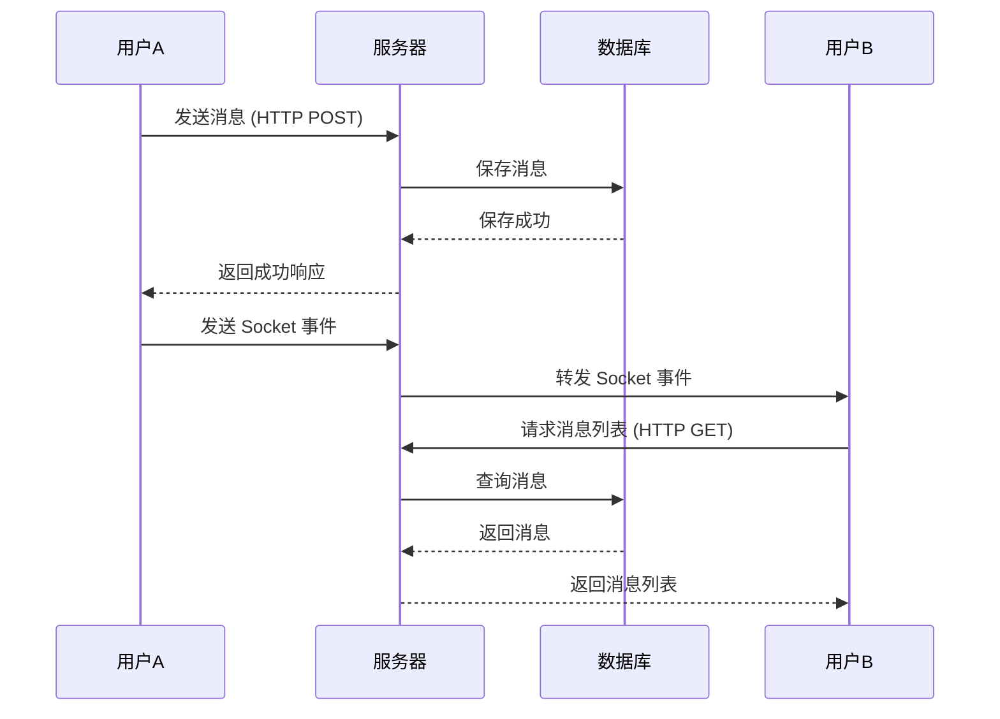

# WebSocket 在 Mini Chat Bar 项目中的应用教学

## 目录
1. [WebSocket 基础概念](# websocket-基础概念)
2. [WebSocket 技术原理深入解析](# websocket-技术原理深入解析)
3. [项目架构概览](#项目架构概览)
4. [服务器端实现](#服务器端实现)
5. [客户端实现](#客户端实现)
6. [实时通信功能](#实时通信功能)
7. [完整代码示例](#完整代码示例)
8. [最佳实践](#最佳实践)
9. [常见问题解决](#常见问题解决)

## WebSocket 基础概念

### 什么是 WebSocket？
WebSocket 是一种在单个 TCP 连接上进行全双工通信的协议。与传统的 HTTP 请求-响应模式不同，WebSocket 允许服务器主动向客户端推送数据，实现真正的实时通信。

Websocket 使用 ws 或 wss 的统一资源标志符（URI），其中 wss 表示使用了 TLS 的 Websocket。


> 早期实现实时通信的是采用短轮询技术
>
> 

### WebSocket vs HTTP
| 特性 | HTTP | WebSocket |
|------|------|----------|
| 通信方式 | 请求-响应 | 全双工 |
| 连接状态 | 无状态 | 有状态 |
| 实时性 | 需要轮询 | 真正实时 |
| 开销 | 每次请求都有头部开销 | 建立连接后开销小 |

### Socket.IO 简介
Socket.IO 是一个基于 WebSocket 的实时通信库，提供了：
- 自动降级（WebSocket → 长轮询 → 短轮询）
- 房间和命名空间管理
- 事件驱动的 API
- 自动重连机制

## WebSocket 技术原理深入解析

### 1. WebSocket 协议详解

#### 1.1 协议标准
WebSocket 协议定义在 RFC 6455 中，是一个独立的基于 TCP 的协议。它与 HTTP 的关系仅仅是其握手阶段被 HTTP+··· 服务器解释为一个 Upgrade 请求。

#### 1.2 协议特点
- **全双工通信**: 客户端和服务器可以同时发送数据
- **低延迟**: 没有 HTTP 的请求/响应开销
- **持久连接**: 一次握手，持续通信
- **二进制支持**: 支持文本和二进制数据传输
- **扩展机制**: 支持协议扩展和子协议

### 2. WebSocket 握手过程详解

#### 2.1 客户端发起握手请求
```http
GET /chat HTTP/1.1
Host: example.com:8000
Upgrade: websocket
Connection: Upgrade
Sec-WebSocket-Key: dGhlIHNhbXBsZSBub25jZQ==
Sec-WebSocket-Version: 13
Sec-WebSocket-Protocol: chat, superchat
Origin: http://example.com
```

**关键字段解析：**
- `Upgrade: websocket`: 告诉服务器要升级到 WebSocket 协议
- `Connection: Upgrade`: 表示连接需要升级
- `Sec-WebSocket-Key`: 客户端生成的随机字符串，用于安全验证
- `Sec-WebSocket-Version`: WebSocket 协议版本（当前为 13）
- `Sec-WebSocket-Protocol`: 可选的子协议列表
- `Origin`: 请求来源，用于跨域验证

#### 2.2 服务器响应握手
```http
HTTP/1.1 101 Switching Protocols
Upgrade: websocket
Connection: Upgrade
Sec-WebSocket-Accept: s3pPLMBiTxaQ9kYGzzhZRbK+xOo=
Sec-WebSocket-Protocol: chat
```

**关键字段解析：**
- `101 Switching Protocols`: 表示协议切换成功
- `Sec-WebSocket-Accept`: 服务器根据客户端的 Key 计算出的响应值
- `Sec-WebSocket-Protocol`: 服务器选择的子协议

#### 2.3 握手验证算法
```javascript
// 服务器端验证过程
function generateAcceptKey(clientKey) {
  const WEBSOCKET_MAGIC_STRING = '258EAFA5-E914-47DA-95CA-C5AB0DC85B11';
  const sha1 = crypto.createHash('sha1');
  sha1.update(clientKey + WEBSOCKET_MAGIC_STRING);
  return sha1.digest('base64');
}

// 示例
const clientKey = 'dGhlIHNhbXBsZSBub25jZQ==';
const acceptKey = generateAcceptKey(clientKey);
console.log(acceptKey); // s3pPLMBiTxaQ9kYGzzhZRbK+xOo=
```

### 3. WebSocket 数据帧结构

#### 3.1 帧格式详解
```
 0                   1                   2                   3
 0 1 2 3 4 5 6 7 8 9 0 1 2 3 4 5 6 7 8 9 0 1 2 3 4 5 6 7 8 9 0 1
+-+-+-+-+-------+-+-------------+-------------------------------+
|F|R|R|R| opcode|M| Payload len |    Extended payload length    |
|I|S|S|S|  (4)  |A|     (7)     |             (16/64)           |
|N|V|V|V|       |S|             |   (if payload len==126/127)   |
| |1|2|3|       |K|             |                               |
+-+-+-+-+-------+-+-------------+ - - - - - - - - - - - - - - - +
|     Extended payload length continued, if payload len == 127  |
+ - - - - - - - - - - - - - - - +-------------------------------+
|                               |Masking-key, if MASK set to 1  |
+-------------------------------+-------------------------------+
| Masking-key (continued)       |          Payload Data         |
+-------------------------------- - - - - - - - - - - - - - - - +
:                     Payload Data continued ...                :
+ - - - - - - - - - - - - - - - - - - - - - - - - - - - - - - - +
|                     Payload Data continued ...                |
+---------------------------------------------------------------+
```

#### 3.2 字段详解

**控制位：**
- `FIN (1 bit)`: 表示这是消息的最后一个分片
- `RSV1-3 (3 bits)`: 保留位，必须为 0
- `Opcode (4 bits)`: 操作码，定义帧类型
  - `0x0`: 继续帧
  - `0x1`: 文本帧
  - `0x2`: 二进制帧
  - `0x8`: 关闭帧
  - `0x9`: Ping 帧
  - `0xA`: Pong 帧

**数据位：**
- `MASK (1 bit)`: 是否使用掩码（客户端发送必须为 1）
- `Payload Length (7 bits)`: 载荷长度
  - 0-125: 实际长度
  - 126: 后续 2 字节为实际长度
  - 127: 后续 8 字节为实际长度

#### 3.3 掩码机制
客户端发送的所有帧都必须使用掩码，防止缓存污染攻击：

```javascript
// 掩码处理
function maskData(data, maskKey) {
  const masked = new Uint8Array(data.length);
  for (let i = 0; i < data.length; i++) {
    masked[i] = data[i] ^ maskKey[i % 4];
  }
  return masked;
}

// 生成随机掩码
function generateMask() {
  return new Uint8Array([
    Math.floor(Math.random() * 256),
    Math.floor(Math.random() * 256),
    Math.floor(Math.random() * 256),
    Math.floor(Math.random() * 256)
  ]);
}
```

### 4. WebSocket 连接状态管理

#### 4.1 连接状态
WebSocket 连接有以下几种状态：

```javascript
// WebSocket 状态常量
const CONNECTING = 0; // 正在连接
const OPEN = 1;       // 连接已建立
const CLOSING = 2;    // 正在关闭
const CLOSED = 3;     // 连接已关闭

// 检查连接状态
function checkConnectionState(ws) {
  switch(ws.readyState) {
    case CONNECTING:
      console.log('WebSocket 正在连接...');
      break;
    case OPEN:
      console.log('WebSocket 连接已建立');
      break;
    case CLOSING:
      console.log('WebSocket 正在关闭...');
      break;
    case CLOSED:
      console.log('WebSocket 连接已关闭');
      break;
  }
}
```

#### 4.2 心跳机制
WebSocket 使用 Ping/Pong 帧实现心跳检测：

```javascript
// 服务器端心跳实现
class WebSocketServer {
  constructor() {
    this.clients = new Set();
    this.startHeartbeat();
  }
  
  startHeartbeat() {
    setInterval(() => {
      this.clients.forEach(client => {
        if (client.readyState === WebSocket.OPEN) {
          // 发送 Ping 帧
          client.ping();
          
          // 设置超时检测
          client.isAlive = false;
          setTimeout(() => {
            if (!client.isAlive) {
              console.log('客户端心跳超时，断开连接');
              client.terminate();
            }
          }, 5000);
        }
      });
    }, 30000); // 每30秒发送一次心跳
  }
  
  onConnection(ws) {
    this.clients.add(ws);
    ws.isAlive = true;
    
    // 监听 Pong 响应
    ws.on('pong', () => {
      ws.isAlive = true;
    });
    
    ws.on('close', () => {
      this.clients.delete(ws);
    });
  }
}
```

#### 4.3 优雅关闭
```javascript
// 客户端优雅关闭
function gracefulClose(ws, code = 1000, reason = 'Normal closure') {
  if (ws.readyState === WebSocket.OPEN) {
    ws.close(code, reason);
  }
}

// 关闭状态码
const CLOSE_CODES = {
  1000: 'Normal Closure',           // 正常关闭
  1001: 'Going Away',              // 端点离开
  1002: 'Protocol Error',          // 协议错误
  1003: 'Unsupported Data',        // 不支持的数据类型
  1004: 'Reserved',                // 保留
  1005: 'No Status Rcvd',          // 未收到状态码
  1006: 'Abnormal Closure',        // 异常关闭
  1007: 'Invalid frame payload data', // 无效的帧载荷数据
  1008: 'Policy Violation',        // 策略违规
  1009: 'Message Too Big',         // 消息过大
  1010: 'Mandatory Ext.',          // 强制扩展
  1011: 'Internal Server Error',   // 内部服务器错误
  1015: 'TLS handshake'            // TLS 握手失败
};
```

### 5. WebSocket 安全机制

#### 5.1 同源策略
```javascript
// 服务器端 Origin 验证
function validateOrigin(origin, allowedOrigins) {
  if (!allowedOrigins.includes(origin)) {
    throw new Error(`Origin ${origin} not allowed`);
  }
}

// 握手时验证
server.on('upgrade', (request, socket, head) => {
  const origin = request.headers.origin;
  const allowedOrigins = ['https://example.com', 'https://app.example.com'];
  
  try {
    validateOrigin(origin, allowedOrigins);
    wss.handleUpgrade(request, socket, head, (ws) => {
      wss.emit('connection', ws, request);
    });
  } catch (error) {
    socket.write('HTTP/1.1 403 Forbidden\r\n\r\n');
    socket.destroy();
  }
});
```

#### 5.2 认证机制
```javascript
// Token 认证
function authenticateWebSocket(request) {
  const url = new URL(request.url, 'http://localhost');
  const token = url.searchParams.get('token');
  
  if (!token) {
    throw new Error('Missing authentication token');
  }
  
  try {
    const decoded = jwt.verify(token, process.env.JWT_SECRET);
    return decoded;
  } catch (error) {
    throw new Error('Invalid authentication token');
  }
}

// 在连接建立时验证
wss.on('connection', (ws, request) => {
  try {
    const user = authenticateWebSocket(request);
    ws.userId = user.id;
    ws.userRole = user.role;
  } catch (error) {
    ws.close(1008, error.message);
    return;
  }
  
  // 连接成功，继续处理...
});
```

#### 5.3 消息验证
```javascript
// 消息格式验证
function validateMessage(message) {
  const schema = {
    type: 'object',
    properties: {
      type: { type: 'string', enum: ['chat', 'file', 'system'] },
      content: { type: 'string', maxLength: 1000 },
      timestamp: { type: 'number' }
    },
    required: ['type', 'content']
  };
  
  // 使用 JSON Schema 验证
  const valid = ajv.validate(schema, message);
  if (!valid) {
    throw new Error('Invalid message format');
  }
}

// 消息处理
ws.on('message', (data) => {
  try {
    const message = JSON.parse(data);
    validateMessage(message);
    
    // 处理有效消息
    handleMessage(ws, message);
  } catch (error) {
    ws.send(JSON.stringify({
      type: 'error',
      message: error.message
    }));
  }
});
```

### 6. WebSocket 性能优化

#### 6.1 消息压缩
```javascript
// 启用 permessage-deflate 扩展
const WebSocket = require('ws');

const wss = new WebSocket.Server({
  port: 8080,
  perMessageDeflate: {
    // 压缩阈值，小于此大小的消息不压缩
    threshold: 1024,
    // 压缩级别 (1-9)
    level: 6,
    // 客户端最大窗口位数
    clientMaxWindowBits: 15,
    // 服务器最大窗口位数
    serverMaxWindowBits: 15,
    // 服务器不使用上下文接管
    serverNoContextTakeover: false,
    // 客户端不使用上下文接管
    clientNoContextTakeover: false
  }
});
```

#### 6.2 连接池管理
```javascript
// WebSocket 连接池
class WebSocketPool {
  constructor(maxConnections = 1000) {
    this.connections = new Map();
    this.maxConnections = maxConnections;
    this.connectionCount = 0;
  }
  
  addConnection(userId, ws) {
    if (this.connectionCount >= this.maxConnections) {
      throw new Error('Connection pool full');
    }
    
    // 如果用户已有连接，关闭旧连接
    if (this.connections.has(userId)) {
      const oldWs = this.connections.get(userId);
      oldWs.close(1000, 'New connection established');
    }
    
    this.connections.set(userId, ws);
    this.connectionCount++;
    
    ws.on('close', () => {
      this.removeConnection(userId);
    });
  }
  
  removeConnection(userId) {
    if (this.connections.has(userId)) {
      this.connections.delete(userId);
      this.connectionCount--;
    }
  }
  
  getConnection(userId) {
    return this.connections.get(userId);
  }
  
  broadcast(message, excludeUserId = null) {
    this.connections.forEach((ws, userId) => {
      if (userId !== excludeUserId && ws.readyState === WebSocket.OPEN) {
        ws.send(message);
      }
    });
  }
}
```

### 7. WebSocket 与其他技术对比

#### 7.1 技术选型对比
| 技术 | 实时性 | 复杂度 | 浏览器支持 | 服务器资源 | 适用场景 |
|------|--------|--------|------------|------------|----------|
| WebSocket | 极高 | 中等 | 现代浏览器 | 中等 | 实时聊天、游戏、协作 |
| Server-Sent Events | 高 | 低 | 现代浏览器 | 低 | 实时通知、数据推送 |
| 长轮询 | 中等 | 低 | 所有浏览器 | 高 | 简单实时更新 |
| 短轮询 | 低 | 极低 | 所有浏览器 | 极高 | 非实时数据获取 |

#### 7.2 使用场景分析

**WebSocket 适用场景：**
- 实时聊天应用
- 在线游戏
- 协作编辑工具
- 实时数据可视化
- 视频会议
- 金融交易系统

**不适用场景：**
- 简单的 API 调用
- 文件上传下载
- 静态内容获取
- 一次性数据查询

## 项目架构概览

```
┌─────────────────┐    WebSocket     ┌─────────────────┐
│   前端 (Vue3)   │ ←──────────────→ │  后端 (Node.js) │
│                 │                  │                 │
│ - Socket.IO     │                  │ - Socket.IO     │
│ - 事件监听      │                  │ - 事件处理      │
│ - 消息发送      │                  │ - 消息广播      │
└─────────────────┘                  └─────────────────┘
                                              │
                                              ▼
                                     ┌─────────────────┐
                                     │   MongoDB       │
                                     │ - 消息存储      │
                                     │ - 用户管理      │
                                     └─────────────────┘
```

## 服务器端实现

### 1. 服务器初始化

```javascript
// server/server.js
require('dotenv').config();
const express = require('express');
const http = require('http');
const { Server } = require('socket.io');
const cors = require('cors');

const app = express();
const server = http.createServer(app);

// 创建 Socket.IO 实例，配置 CORS
const io = new Server(server, { 
  cors: { 
    origin: '*'  // 生产环境中应该指定具体域名
  } 
});

// 配置中间件
app.use(cors({ origin: '*' }));
app.use(express.json());
app.use(express.urlencoded({ extended: true }));

// Socket.IO 连接处理
io.on("connection", (socket) => {
  console.log('用户连接:', socket.id);
  
  // 加载私聊和群聊模块
  require('./sockets/chat')(socket, io);
  require('./sockets/room')(socket, io);
});

server.listen(3000, () => {
  console.log('服务器运行在 http://localhost:3000');
});
```

### 2. 私聊功能实现

```javascript
// server/sockets/chat.js
const users = new Map(); // 存储在线用户

module.exports = function(socket, io) {
  // 用户登录事件
  socket.on("login", (userId) => {
    socket.userId = userId;
    users.set(userId, socket.id);
    console.log(`用户 ${userId} 已连接`);
  });

  // 私聊文本消息
  socket.on("private-message", ({ to }) => {
    const targetSocketId = users.get(to);
    if (targetSocketId) {
      // 发送给目标用户
      io.to(targetSocketId).emit('private-message', {
        from: socket.userId
      });
    }
  });

  // 私聊文件消息
  socket.on("private-file-message", async ({ to, fileUrl, fileName, fileType, messageType }) => {
    const targetSocketId = users.get(to);
    if (targetSocketId) {
      console.log(`用户 ${socket.userId} 发送${messageType === 'image' ? '图片' : '文件'}: ${fileName}`);
      
      io.to(targetSocketId).emit("private-file-message", {
        from: socket.userId,
        fileUrl,
        fileName,
        fileType,
        messageType
      });
    } else {
      console.log(`用户 ${to} 不在线，消息已存储到数据库`);
    }
  });

  // 消息删除事件
  socket.on("message-deleted", ({ messageId, chatWith }) => {
    const targetSocketId = users.get(chatWith);
    if (targetSocketId) {
      io.to(targetSocketId).emit("message-deleted", {
        messageId,
        chatWith: socket.userId
      });
    }
  });

  // 头像更新广播
  socket.on('avatar-updated', (data) => {
    socket.broadcast.emit('avatar-updated', data);
  });

  // 用户断开连接
  socket.on("disconnect", () => {
    console.log("用户断开连接:", socket.id);
    
    // 清理用户映射
    for (const [userId, socketId] of users) {
      if (socketId === socket.id) {
        users.delete(userId);
        break;
      }
    }
  });
};
```

### 3. 群聊功能实现

```javascript
// server/sockets/room.js
const Room = require("../models/Room");

module.exports = function(socket, io) {
  const avatars = ["🐔", "🐱", "🐮", "🐶", "🐹", "🐵", "🦊", "🐸"];
  const seats = Array.from({ length: 8 }, () => ({
    username: null,
    useravatar: "🪑",
    userID: null,
  }));

  // 用户加入房间
  function userEnter(username) {
    const index = seats.findIndex(seat => seat.username === null);
    if (index !== -1) {
      seats[index] = {
        username,
        useravatar: avatars[index],
        userID: socket.id
      };
      
      console.log(`用户 [${username}] 加入房间，占用座位 [${index}]`);
      io.emit("update", seats); // 广播座位更新
    } else {
      socket.emit("Full"); // 房间已满
    }
  }

  // 用户离开房间
  function userExit() {
    const index = seats.findIndex(seat => seat.userID === socket.id);
    if (index !== -1) {
      const username = seats[index].username;
      seats[index] = { username: null, useravatar: "🪑", userID: null };
      
      console.log(`用户 [${username}] 离开房间，释放座位 [${index}]`);
      io.emit("update", seats);
    }
  }

  // 监听加入房间事件
  socket.on("joinroom", ({ room, username }) => {
    socket.data.room = room;
    socket.data.username = username;
    
    userEnter(username);
    socket.join(room); // 加入 Socket.IO 房间
    
    // 向房间内所有用户发送通知
    io.to(room).emit("notice", `用户 ${username} 进入房间`);
  });

  // 监听群聊消息
  socket.on("group-message", (msg, uname) => {
    console.log(`${uname}发来：${msg}`);
    // 向房间内所有用户广播消息
    io.to(socket.data.room).emit("group-message", { msg, uname });
  });

  // 用户断开连接
  socket.on("disconnect", async () => {
    userExit();
    
    if (socket.data.room && socket.data.username) {
      io.to(socket.data.room).emit("notice", `用户 ${socket.data.username} 离开房间`);
      
      // 检查房间是否为空，如果为空则删除数据库记录
      const room = io.sockets.adapter.rooms.get(socket.data.room);
      const roomSize = room ? room.size : 0;
      
      if (roomSize === 0) {
        try {
          await Room.deleteOne({ roomID: socket.data.room });
          console.log(`房间 [${socket.data.room}] 已从数据库删除`);
        } catch (err) {
          console.error("删除房间失败：", err);
        }
      }
    }
  });
};
```

## 客户端实现

### 1. Socket 连接初始化

```javascript
// ccb/utils/socket.js
import { io } from "socket.io-client";

// 创建 Socket 连接
const socket = io(`${import.meta.env.VITE_BASE_URL}`);

// 等待连接建立的工具函数
function waitForSocketConnection(callback) {
  if (socket.connected) {
    callback();
  } else {
    socket.on("connect", () => {
      callback();
    });
  }
}

export { socket, waitForSocketConnection };
```

### 2. Vue 组件中的 Socket 使用

```javascript
// ccb/src/views/Content.vue (关键部分)
import { socket } from "../../utils/socket";
import { ref, onMounted, onBeforeUnmount } from "vue";

export default {
  setup() {
    const messages = ref([]);
    const newMessage = ref("");
    
    // 发送文本消息
    async function sendMessage() {
      if (newMessage.value.trim()) {
        try {
          // 1. 先保存到数据库
          const token = localStorage.getItem("token");
          await axios.post(`${baseUrl}/chat/messages/${targetUserId}`, 
            { content: newMessage.value },
            { headers: { Authorization: `Bearer ${token}` } }
          );
          
          // 2. 通过 Socket 发送实时通知
          socket.emit("private-message", { 
            to: targetUserId 
          });
          
          newMessage.value = "";
        } catch (err) {
          console.error("发送失败：", err);
        }
      }
    }
    
    // 发送文件消息
    async function sendFileMessage(fileInfo, messageType) {
      try {
        // 1. 保存到数据库
        const token = localStorage.getItem("token");
        await axios.post(`${baseUrl}/chat/file-message/${targetUserId}`, 
          { fileInfo, messageType },
          { headers: { Authorization: `Bearer ${token}` } }
        );
        
        // 2. 通过 Socket 发送实时通知
        socket.emit("private-file-message", {
          to: targetUserId,
          fileUrl: fileInfo.fileUrl,
          fileName: fileInfo.fileName,
          fileType: fileInfo.fileType,
          messageType: messageType
        });
      } catch (err) {
        console.error("文件发送失败:", err);
      }
    }
    
    // 监听 Socket 事件
    onMounted(() => {
      // 监听私聊消息
      socket.on("private-message", async ({ from }) => {
        console.log(`收到${from}发来的信息`);
        if (from === currentChatUser) {
          await refreshMessageList(); // 刷新消息列表
        }
      });
      
      // 监听文件消息
      socket.on("private-file-message", async ({ from, fileUrl, fileName, fileType, messageType }) => {
        console.log(`收到${from}发来的${messageType === 'image' ? '图片' : '文件'}: ${fileName}`);
        if (from === currentChatUser) {
          await refreshMessageList();
        }
      });
      
      // 监听消息删除
      socket.on("message-deleted", ({ messageId }) => {
        messages.value = messages.value.filter(msg => msg._id !== messageId);
      });
    });
    
    // 清理事件监听
    onBeforeUnmount(() => {
      socket.off("private-message");
      socket.off("private-file-message");
      socket.off("message-deleted");
    });
    
    return {
      messages,
      newMessage,
      sendMessage,
      sendFileMessage
    };
  }
};
```

## 实时通信功能

### 1. 私聊消息流程



### 2. 群聊房间管理

```javascript
// 房间管理示例
class RoomManager {
  constructor(io) {
    this.io = io;
    this.rooms = new Map(); // 房间信息缓存
  }
  
  // 用户加入房间
  joinRoom(socket, roomId, username) {
    socket.join(roomId);
    
    // 更新房间信息
    if (!this.rooms.has(roomId)) {
      this.rooms.set(roomId, {
        users: new Set(),
        createdAt: new Date()
      });
    }
    
    this.rooms.get(roomId).users.add(username);
    
    // 广播用户加入事件
    this.io.to(roomId).emit('user-joined', {
      username,
      userCount: this.rooms.get(roomId).users.size
    });
  }
  
  // 用户离开房间
  leaveRoom(socket, roomId, username) {
    socket.leave(roomId);
    
    if (this.rooms.has(roomId)) {
      this.rooms.get(roomId).users.delete(username);
      
      // 如果房间为空，删除房间
      if (this.rooms.get(roomId).users.size === 0) {
        this.rooms.delete(roomId);
      } else {
        // 广播用户离开事件
        this.io.to(roomId).emit('user-left', {
          username,
          userCount: this.rooms.get(roomId).users.size
        });
      }
    }
  }
  
  // 广播消息到房间
  broadcastToRoom(roomId, event, data) {
    this.io.to(roomId).emit(event, data);
  }
}
```

### 3. 文件传输处理

```javascript
// 文件上传和实时通知
async function handleFileUpload(req, res, socket) {
  try {
    // 1. 处理文件上传
    const file = req.file;
    const fileInfo = {
      fileName: file.originalname,
      fileUrl: `/uploads/${file.filename}`,
      fileSize: file.size,
      fileType: file.mimetype
    };
    
    // 2. 保存文件信息到数据库
    const message = new Message({
      from: req.user.uid,
      to: req.params.targetId,
      messageType: file.mimetype.startsWith('image/') ? 'image' : 'file',
      fileInfo: fileInfo,
      time: new Date()
    });
    
    await message.save();
    
    // 3. 通过 Socket 实时通知
    const targetSocketId = users.get(req.params.targetId);
    if (targetSocketId) {
      socket.to(targetSocketId).emit('private-file-message', {
        from: req.user.uid,
        messageType: message.messageType,
        fileInfo: fileInfo,
        messageId: message._id
      });
    }
    
    res.json({ success: true, fileInfo });
  } catch (error) {
    res.status(500).json({ error: error.message });
  }
}
```

## 完整代码示例

### 简单聊天应用

```html
<!-- 前端 HTML -->
<!DOCTYPE html>
<html>
<head>
    <title>WebSocket 聊天示例</title>
    <script src="/socket.io/socket.io.js"></script>
</head>
<body>
    <div id="messages"></div>
    <input id="messageInput" type="text" placeholder="输入消息...">
    <button onclick="sendMessage()">发送</button>
    
    <script>
        const socket = io();
        
        // 监听消息
        socket.on('message', (data) => {
            const messages = document.getElementById('messages');
            messages.innerHTML += `<div>${data.username}: ${data.message}</div>`;
        });
        
        // 发送消息
        function sendMessage() {
            const input = document.getElementById('messageInput');
            const message = input.value;
            
            if (message.trim()) {
                socket.emit('message', {
                    username: 'User',
                    message: message
                });
                input.value = '';
            }
        }
        
        // 回车发送
        document.getElementById('messageInput').addEventListener('keypress', (e) => {
            if (e.key === 'Enter') {
                sendMessage();
            }
        });
    </script>
</body>
</html>
```

```javascript
// 后端服务器
const express = require('express');
const http = require('http');
const socketIo = require('socket.io');

const app = express();
const server = http.createServer(app);
const io = socketIo(server);

// 静态文件服务
app.use(express.static('public'));

// Socket.IO 连接处理
io.on('connection', (socket) => {
    console.log('用户连接:', socket.id);
    
    // 监听消息事件
    socket.on('message', (data) => {
        console.log('收到消息:', data);
        
        // 广播给所有连接的客户端
        io.emit('message', {
            username: data.username,
            message: data.message,
            timestamp: new Date().toISOString()
        });
    });
    
    // 用户断开连接
    socket.on('disconnect', () => {
        console.log('用户断开连接:', socket.id);
    });
});

server.listen(3000, () => {
    console.log('服务器运行在 http://localhost:3000');
});
```

## 最佳实践

### 1. 错误处理

```javascript
// 客户端错误处理
socket.on('connect_error', (error) => {
  console.error('连接失败:', error);
  // 显示用户友好的错误信息
  showNotification('连接服务器失败，请检查网络连接', 'error');
});

socket.on('disconnect', (reason) => {
  console.log('连接断开:', reason);
  if (reason === 'io server disconnect') {
    // 服务器主动断开，需要重新连接
    socket.connect();
  }
});

// 服务器端错误处理
socket.on('error', (error) => {
  console.error('Socket 错误:', error);
  socket.emit('error-response', {
    message: '服务器内部错误',
    code: 'INTERNAL_ERROR'
  });
});
```

### 2. 认证和授权

```javascript
// 服务器端认证中间件
io.use((socket, next) => {
  const token = socket.handshake.auth.token;
  
  try {
    const decoded = jwt.verify(token, process.env.JWT_SECRET);
    socket.userId = decoded.userId;
    next();
  } catch (err) {
    next(new Error('Authentication error'));
  }
});

// 客户端发送认证信息
const socket = io({
  auth: {
    token: localStorage.getItem('authToken')
  }
});
```

### 3. 性能优化

```javascript
// 消息限流
const rateLimit = new Map();

socket.on('message', (data) => {
  const userId = socket.userId;
  const now = Date.now();
  
  // 检查发送频率（每秒最多5条消息）
  if (!rateLimit.has(userId)) {
    rateLimit.set(userId, []);
  }
  
  const userMessages = rateLimit.get(userId);
  userMessages.push(now);
  
  // 清理1秒前的记录
  const oneSecondAgo = now - 1000;
  const recentMessages = userMessages.filter(time => time > oneSecondAgo);
  rateLimit.set(userId, recentMessages);
  
  if (recentMessages.length > 5) {
    socket.emit('rate-limit-exceeded', {
      message: '发送消息过于频繁，请稍后再试'
    });
    return;
  }
  
  // 处理消息...
});
```

### 4. 内存管理

```javascript
// 定期清理断开连接的用户
setInterval(() => {
  for (const [userId, socketId] of users.entries()) {
    const socket = io.sockets.sockets.get(socketId);
    if (!socket || !socket.connected) {
      users.delete(userId);
      console.log(`清理断开连接的用户: ${userId}`);
    }
  }
}, 30000); // 每30秒清理一次
```

## 常见问题解决

### 1. 连接问题

**问题**: 客户端无法连接到服务器

**解决方案**:
```javascript
// 检查 CORS 配置
const io = new Server(server, {
  cors: {
    origin: ["http://localhost:3000", "http://localhost:5173"],
    methods: ["GET", "POST"]
  }
});

// 客户端指定正确的服务器地址
const socket = io('http://localhost:3000', {
  transports: ['websocket', 'polling'] // 指定传输方式
});
```

### 2. 消息重复

**问题**: 收到重复的消息

**解决方案**:
```javascript
// 使用消息ID去重
const receivedMessages = new Set();

socket.on('message', (data) => {
  if (receivedMessages.has(data.messageId)) {
    return; // 忽略重复消息
  }
  
  receivedMessages.add(data.messageId);
  
  // 处理消息...
  
  // 定期清理旧的消息ID
  if (receivedMessages.size > 1000) {
    receivedMessages.clear();
  }
});
```

### 3. 内存泄漏

**问题**: 长时间运行后内存占用过高

**解决方案**:
```javascript
// 正确清理事件监听器
const cleanup = () => {
  socket.off('message');
  socket.off('disconnect');
  socket.off('error');
};

// 在组件卸载时清理
onBeforeUnmount(() => {
  cleanup();
});

// 服务器端清理
socket.on('disconnect', () => {
  // 清理用户相关数据
  users.delete(socket.userId);
  rooms.forEach(room => {
    room.users.delete(socket.userId);
  });
});
```

### 4. 断线重连

```javascript
// 客户端自动重连
socket.on('disconnect', () => {
  console.log('连接断开，尝试重连...');
  
  // 显示重连状态
  showConnectionStatus('正在重连...');
});

socket.on('connect', () => {
  console.log('重连成功');
  
  // 重新加入房间或重新认证
  if (currentRoom) {
    socket.emit('joinroom', { room: currentRoom, username: currentUser });
  }
  
  showConnectionStatus('已连接');
});
```

## 总结

WebSocket 技术为实时通信应用提供了强大的基础，通过 Socket.IO 库，我们可以轻松实现：

1. **实时消息传递** - 文本、图片、文件等多种类型
2. **房间管理** - 群聊、私聊等不同场景
3. **状态同步** - 在线状态、消息状态等
4. **事件驱动** - 灵活的事件处理机制

在实际开发中，需要注意：
- 合理的错误处理和重连机制
- 性能优化和内存管理
- 安全认证和权限控制
- 消息持久化和离线处理

通过本教程的学习，你应该能够理解 WebSocket 的基本原理，并在自己的项目中实现类似的实时通信功能。